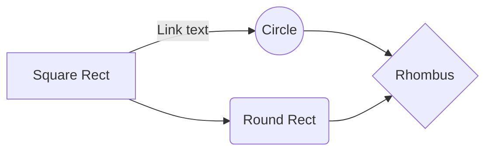

# remark-mermaid-nextra

Remark plugin for rendering mermaid diagrams, should work in [nextra](https://github.com/shuding/nextra)

Note that this is an ESM package!
Make sure you are using ESM in your Next configuration before attempting to use
this package.

# Instalation

`yarn add remark-mermaid-nextra` \
`npm i remark-mermaid-nextra`

# Motivation

I could not find any way to use Mermaid diagrams in nextra.
Then I found [The Guild Component Library](https://github.com/the-guild-org/docs). They have solution to make it works.
I take their code and use only necessary parts to make plugin works.

# Usage

```ts
// next.config.mjs

import { remarkMermaid } from 'remark-mermaid-nextra';

const withNextra = nextra({
    mdxOptions: {
        remarkPlugins: [remarkMermaid],
    }
    ...
```

~~~mdx
// page.mdx


~~~
